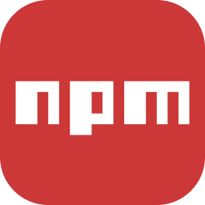

### Привет! 👋 Меня зовут Евгений, я начинающий фронтенд-разработчик. Прошел курс обучения в школе программирования "TeachMeSkills".

### Добро пожаловать на мою страницу GitHub! Здесь я демонстрирую свои проекты. 🚀

---

### 🛠️ Языки программирования и инструменты:

 

---
